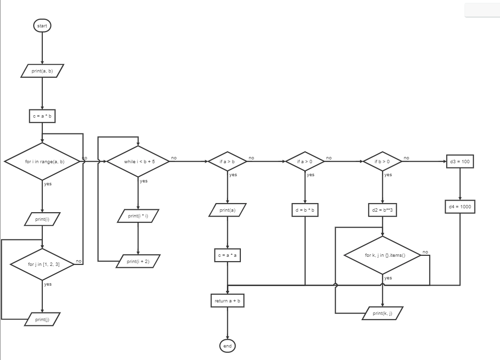

# py2flowchart

Generates flowchart from Python functions and python file.
让简单的Python函数或文件生成流程图
（流程图可用flowchart.js来显示，也可以用于typora等md文件中）
（在typora中用```flow.....```表示流程图）

## Examples
```python
from py2flowchart import * 
pyfile2flowchart("xxxx.py", "xxxx.html")

get_flowchart("if a>b:\n    print(c)")

def myfun():
    pass
get_flowchart(myfun) 
```


## FAQs
Which Python version? ... Using 3.x AST.
This prog is very limited, it can use for "if,for,while" statement, but not for "break,continue"


## Thanks
this programe was inspired by [latexify_py](https://github.com/google/latexify_py)

## about
dstang2000@263.net
